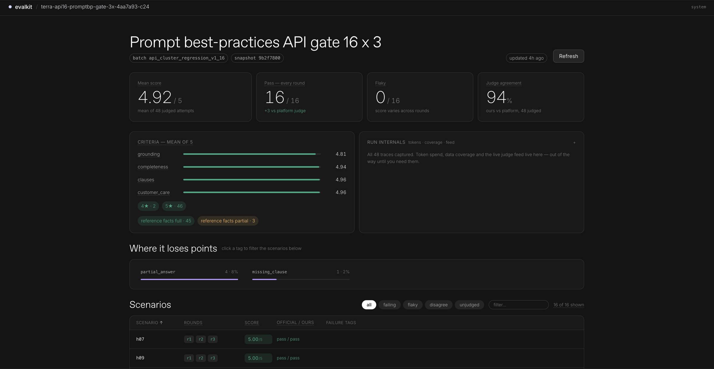

<div align="center">

# EvalKit

**Run, judge, compare, and inspect evaluations for Wonderful agents.**

A local-first evaluation loop powered by snapshot-pinned Wonderful Chat V3,
deterministic tool checks, a 1–5 LLM judging panel, and a dashboard that drills
from campaign trends down to individual conversations.

<p>
  <code>Python 3.12+</code> · <code>FastAPI</code> · <code>React</code> · <code>wful</code>
</p>

</div>

<p align="center">
  
  <br>
  <sub><strong>API regression gate:</strong> 16 scenarios across 3 rounds, with deterministic checks and per-scenario drill-down.</sub>
</p>

## What it does

- Runs live scenarios directly against Wonderful agent snapshots, or imports cached results.
- Collects traces, result payloads, activity records, and token usage.
- Enforces deterministic tool contracts before an LLM judge runs.
- Grades each attempt with a multi-criterion 1–5 rubric and stores every vote.
- Compares campaigns and, for imported/final-gate artifacts, the platform evaluator
  without letting either overwrite the underlying evidence.
- Serves a live, read-only dashboard for campaign and conversation-level analysis.

## Quick start

Create the environment and configure the agent, workspace, and `wful` profile:

```bash
python3 -m venv .venv
.venv/bin/pip install -e .
cp evalkit.example.toml evalkit.toml
.venv/bin/python -m evalkit.cli doctor
```

Run a live campaign, or turn cached platform results into one:

```bash
.venv/bin/python -m evalkit.cli run --agent vera --rounds 3
.venv/bin/python -m evalkit.cli import <dir> --agent vera
```

Judge, reaggregate, and compare campaigns:

```bash
.venv/bin/python -m evalkit.cli judge <campaign>
.venv/bin/python -m evalkit.cli reaggregate <campaign>
.venv/bin/python -m evalkit.cli report <campaign> --vs <other>
```

Build and launch the dashboard at [http://localhost:4747](http://localhost:4747):

```bash
cd dashboard && pnpm install && pnpm build && cd ..
.venv/bin/python -m evalkit.cli serve
```

## How scoring works

The binary pass is a bridge for comparisons, not the source of truth. By default,
every turn must average at least 4/5, with no blocking deterministic failure and
no catastrophic 1/5 criterion. A 2/5 is still highlighted and lowers the mean,
but does not veto an otherwise strong answer.

`evalkit.toml` names the agent, `wful` profile, workspace, and local judge.
EvalKit uses `wful` for explicit context, snapshots, traces, and activities, then
collects the agent through Chat V3. Its CLI allowlist deliberately forbids
`wful eval run`; development runs never invoke the Wonderful platform judge.

## Deterministic tool contracts (v5)

Scenarios may add `metadata.evalkit_v5` to a turn. EvalKit enforces these fields
before the LLM judge runs:

```json
{
  "response_mode": "answer",
  "required_tools": ["get_line_usage", "lookup_tim_info"],
  "forbidden_tools": ["get_line_context"],
  "tool_sequence": ["get_line_usage", "lookup_tim_info"],
  "tool_cardinality": {
    "get_line_usage": { "min": 1, "max": 1 },
    "lookup_tim_info": { "min": 1, "max": 1 }
  }
}
```

`expected_input` on a tool mock is checked structurally (`{}` therefore means
the tool must receive no arguments). Repeated mocks for the same tool are
matched and consumed independently, so order and multiplicity are observable.

For Vera the default is the full configured suite, 3 rounds, execution
concurrency 24 and judge concurrency 64 under the configured rate limiter. The
platform executes the agent and supplies trace/activity artifacts; EvalKit's
deterministic checks and local judge determine the development score. Direct
campaigns intentionally have no official platform verdict.

## Repository notes

- `STATE.md` tracks measured results, current work, and open threads.
- `data/` contains collected customer data and is never committed.
- Design notes live at the top of each module.
